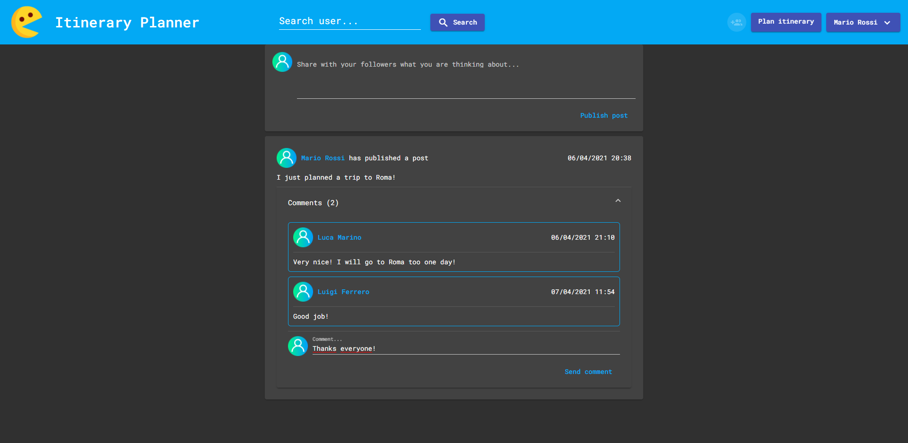
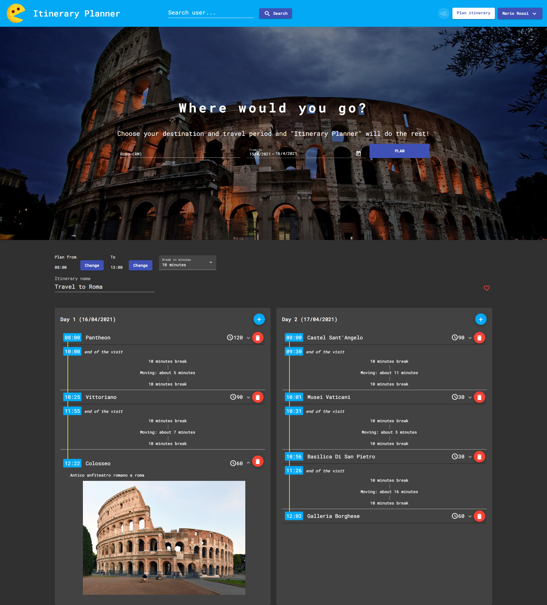
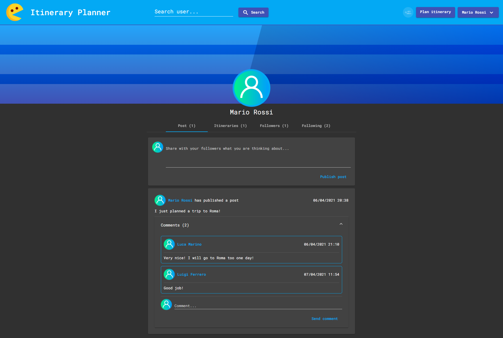

# Itinerary Planner
The main objective of this project is to develop an itinerary planification for travels. It will help users to plan an itinerary in order to see the best tourist attractions of a city (or nearly).

The project is mainly focused on aspects related to the travel planification and, on top of that, it will be implemented a small social network. The server-side of the web application is developed in Java using Spring Boot. Instead, the client-side of the web application is developer using Angular 11.

## Screenshots

Here you can see some screenshots of the application.

This is the home page of the social network

Here, instead, you can see the output of the "Itinerary Planner" algorithm. We have various days and for each day we have an itinerary.

This is instead the profile page for a generic user.

## Wikidata
One of the interesting part of this project is that the ""Tourist Attraction" table is filled up of different Wikidata entities.

[Wikidata](https://www.wikidata.org/wiki/Wikidata:Main_Page) is part of the Web 3.0 (semantic web). It is a free and open knowledge base that can be read and edited by both humans and machines using SPARQL query language. In ***wikidata_scripts_retrieve*** folder you can see some scripts that I have used to export data and to create PostgreSQL queries that will be execute at server-side startup.

## Server-side Setup

This small guide is written in order to properly setup and run the server-side Spring Boot project.

### Prerequisites

1. Java (or open-jdk for Linux users)
2. Maven
3. PostgreSQL

*Note*: you will need to properly setup the *PATH* (to add maven folder) and *JAVA_HOME* environment variables correctly. Also you need to have the credentials of the database in order to properly run the server, otherwise it will not connect to the database and it will give an exception.

### Run the server-side

First of all you need to properly configure the ***itineray_server/src/main/resources/application.properties*** file in order to update the following environment variables:
1. **spring.datasource.url**: database connection URL
2. **spring.datasource.username**: database user username
3. **spring.datasource.password**: database user password

Then, to run the server-side it's sufficient to run the following command

`cd itinerary_server`

`mvn clean spring-boot:run`

After the setup, if everything is correct, into the URL http://localhost:8080/public/swagger-ui.html you will find the Swagger of this project, with a list of all the REST endpoints.

## Client-side setup

This small guide is written in order to properly setup and run the client-side Angular project.

### Prerequisites

1. npm

### Run the client-side

First of all you need to go into the client-side folder using this command 

`cd itinerary-fe`

Then you need to install all the dependences

`npm install`

After then you can run your project using 

`npm run start`

Now you can simply open your browser into http://localhost:4200/home